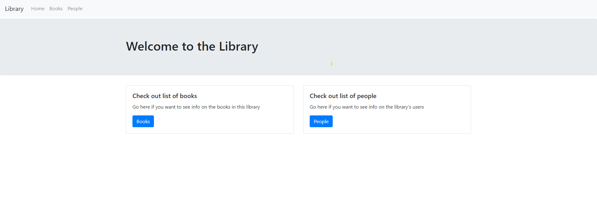

# nla-project

Simple library application.

Run the following commands to get it up and running:
```shell script
git clone https://github.com/fabiofarina92/nla-project.git
mvn springboot:run
```

Navigate to `http://localhost:8080`

